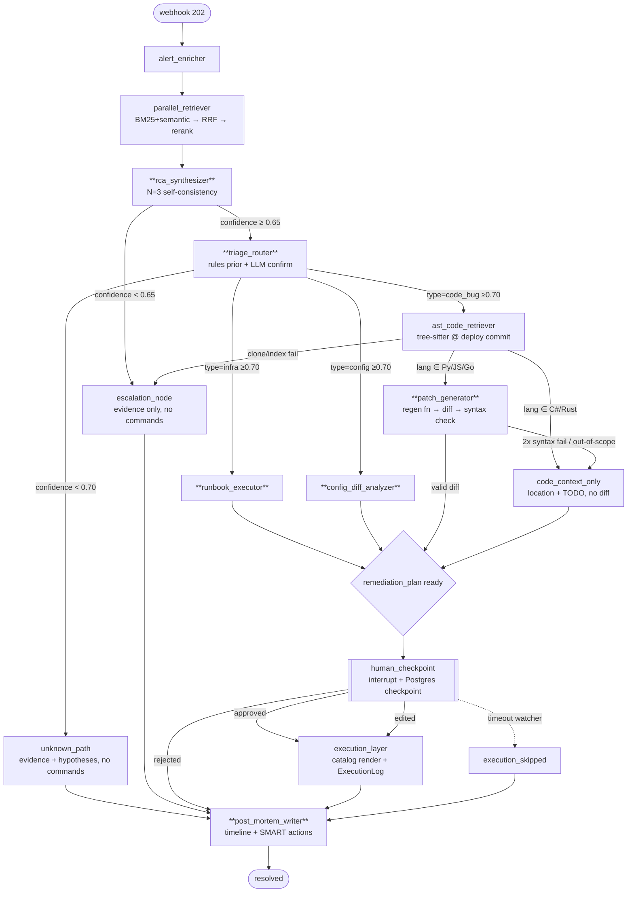

# Agent Orchestration: IncidentIQ

> Adapted from the information-architecture template for an **agent system**.
> Site map → **graph map**. Navigation → **control flow & routing**. Content hierarchy →
> **state schema**. User flows → **incident processing flows**. URL strategy → **state-key &
> API strategy**. Reads from `DESIGN_BRIEF.md` in this folder.

---

## 1. Graph Map (the LangGraph state machine)

One flat `StateGraph` (decision #8). Nodes are agents; conditional edges implement triage
and failure routing. Deterministic nodes are plain; **LLM nodes are bold**.

> **Implementation note (Task 9):** `alert_enricher` runs as a **pre-graph step** in the
> FastAPI background task, not as a graph node. It is the single untrusted→trusted conversion
> (D-9); the graph therefore always receives an already-enriched, trusted `IncidentContext`
> (a *required* field of `IncidentState`). Graph entry node is `parallel_retriever`.



**Node legend** — bold = LLM call. RCA fans out to N=3 generations behind the global
semaphore (decision #7); all other LLM nodes are single calls.

### State lifecycle (status enum)

```
created → investigating → awaiting_approval → executing → resolved
                       ↘ escalated / unknown ↘ (post-mortem) ↘ resolved
                       ↘ timed_out_pending_approval ↘ (post-mortem, execution_skipped)
```

---

## 2. Control Flow & Routing ("Navigation Model")

### 2.1 Routing functions (conditional edges)

Routing is **deterministic code reading typed state fields** — never an LLM deciding the
edge. This is what makes every branch unit-testable (FR-11) and the safety story auditable.

| Edge source | Routing function reads | Targets | Rule |
|---|---|---|---|
| `rca_synthesizer` | `rca_report.confidence_score` | `escalation_node` \| `triage_router` | `< 0.65 → escalate` (FR-08) |
| `triage_router` | `triage_decision.{incident_type, confidence}` | `runbook_executor` \| `config_diff_analyzer` \| `ast_code_retriever` \| `unknown_path` | `confidence < 0.70 → unknown` (never infra default, FR-10) |
| `ast_code_retriever` | `code_context.{language, retrieval_ok}` | `patch_generator` \| `code_context_only` \| `escalation_node` | Py/JS/Go→patch; C#/Rust→localize; fail→escalate |
| `patch_generator` | `patch.syntax_valid`, `patch.scope_ok`, attempt count | `human_checkpoint` \| `code_context_only` | 2 failed attempts **or `scope_ok=False`** → localize-only (FR-14, SF-5) |
| `human_checkpoint` | `approval_decision.decision` | `execution_layer` \| `post_mortem_writer` | approved/edited→exec; rejected→PM |
| timeout watcher | wall-clock vs `APPROVAL_TIMEOUT_MINUTES` | resume → `execution_skipped` | FR-28 |

### 2.2 The confidence gate chain (the safety spine)

Two gates, both reading the **composite signal-derived** score (decision #1), never a raw
LLM float:

```
composite_confidence = clamp01(
    w_self * self_consistency_agreement        # share of N=3 RCA samples agreeing on root service
  + w_ret  * retrieval_evidence_strength       # f(top-k sim, #chunks>threshold, retriever agreement)
  - 0.15 * (chunks_over_threshold < 2)         # FR-06 weak-retrieval penalty
  - 0.10 * alerts_truncated                    # FR-24 truncation penalty
)
```

- Gate A (RCA): `< 0.65` → **escalation** (halt, Slack-ready summary).
- Gate B (triage): `< 0.70` → **unknown** (evidence + hypotheses, **no commands**).
  Triage confidence additionally drops on **rule↔LLM disagreement** (decision #4).

> Weights `w_self`, `w_ret` and thresholds are **tuned against the golden set in week 6**,
> not hardcoded blindly — see Risk #1 in the brief.

### 2.3 Concurrency model (decision #7)

```
┌─ FastAPI ─────────────────────────────────────────────┐
│ POST /incidents → persist + 202 (no LLM)  [<200ms]     │
│        └─ background task → graph.ainvoke(incident)    │
│                                                        │
│ Incidents: SERIAL (one graph run at a time)            │
│ Ollama access: ALL calls await global asyncio.Semaphore(1) │
│   → RCA N=3 generations run sequentially through it     │
└────────────────────────────────────────────────────────┘
```

One 8 GB GPU = one in-flight generation. The semaphore makes latency additive and
predictable; no VRAM thrash. Embedding + reranker run on CPU/GPU off the LLM path.

---

## 3. State Schema ("Content Hierarchy")

Single `IncidentState` (Pydantic) threaded through every node — the audit trail and the
checkpoint payload. Ordered by lifecycle. **All nested types are Pydantic v2 models;
LLM-produced ones are grammar-constrained at decode (decision #2).**

| Field | Type | Set by | Read by | Notes |
|---|---|---|---|---|
| `incident_id` | `str` (UUID) | webhook receiver | all | audit key; checkpoint thread id |
| `status` | `IncidentStatus` (enum) | every node | UI, router | drives Streamlit + state machine |
| `raw_payload` | `dict` | webhook receiver | enricher, PM writer | persisted on receipt (FR-04) |
| `alertmanager_fingerprint` | `str` | webhook receiver | dedup (FR-24) | primary dedup key |
| `incident_context` | `IncidentContext` | enricher | all retrieval/LLM | owner, repo, deploys, `deploy_gap_minutes`, `traceback`, `alerts_truncated` |
| `retrieved_context` | `RetrievedContext` | parallel_retriever | rca_synthesizer | post-engineered: fused+reranked top-5 + `chunk_id`s |
| `rca_report` | `RCAReport` | rca_synthesizer | triage, PM writer | `probable_cause`, `confidence_score` (composite), `source_citations[]`, `top_hypotheses[]` |
| `triage_decision` | `TriageDecision` | triage_router | conditional edge | `incident_type ∈ {infra,config,code_bug,unknown}`, `confidence`, `rule_prior`, `llm_agreed` |
| `code_context` | `CodeContext?` | ast_code_retriever | patch_generator | file/function/callers, `language`, `retrieval_ok` |
| `remediation_plan` | `RemediationPlan?` | path agents | checkpoint, exec | **list of `{command_id, args}` intents** or patch ref — never shell strings |
| `patch` | `Patch?` | patch_generator | checkpoint, PR | unified diff (derived), `syntax_valid`, `pr_url` |
| `approval_decision` | `ApprovalDecision?` | human_checkpoint | exec, PM writer | `decision`, `notes`, `edited_plan?` — required before exec |
| `execution_log` | `ExecutionLog` | execution_layer | PM writer | append-only, immutable; args/stdout/exit/timestamp |
| `errors` | `list[TypedError]` | any node | escalation_node | typed failure + reason (decision #10) |
| `trace` | `list[AgentSpan]` | every node | observability/SSE | `start`, `end`, `token_count`, `redaction_applied` |

**Reducer note:** `errors` and `trace` use additive reducers (LangGraph `Annotated[..., add]`);
scalar fields are last-write-wins. This lets parallel/retry paths append safely.

---

## 4. Incident Processing Flows ("User Flows")

### Flow A — Code bug, supported language (the headline path)

1. Alert fires → `POST /api/v1/incidents` → 202 in <200 ms; record persisted; background graph starts.
2. `alert_enricher` attaches owner/repo/deploys + `traceback` from `public_annotations`.
3. `parallel_retriever` runs post-mortem + runbook search concurrently → RRF → rerank → top-5.
4. `rca_synthesizer` (N=3) → `RCAReport` with citations; composite confidence computed.
   - If `< 0.65` → **escalation** (Flow D).
5. `triage_router`: rule prior (`traceback present + recent deploy → code_bug`) + LLM confirm.
   - Disagreement or `< 0.70` → **unknown** (Flow C).
6. `ast_code_retriever`: cache-aware shallow clone @ deploy commit → tree-sitter → offending function + callers.
   - Clone/index fail → **escalation**.
7. `patch_generator`: regenerate function body → deterministic diff → syntax-validate.
   - 2 failures → `code_context_only` (location + TODO, no diff).
8. `remediation_plan` + `patch` ready → **`human_checkpoint`** (`interrupt()`): RCA + plan + citations + diff rendered.
9. Engineer **approves** → `execution_layer` (catalog render / draft PR) → `ExecutionLog`.
10. Alertmanager **RESOLVED** webhook (FR-29) → `post_mortem_writer` → timeline + SMART actions → `resolved`.

### Flow B — Infra / config

Same through step 5; routes to `runbook_executor` (infra) or `config_diff_analyzer` (config).
Both emit a `RemediationPlan` of **catalog command intents** (e.g. `flag_rollback`, `kubectl_*`).
Checkpoint → approve → catalog render executes (e.g. flag rollback) → post-mortem.

### Flow C — Unknown (low triage confidence < 0.70)

Triage routes to `unknown_path`. System emits an **evidence summary + ranked hypotheses**,
generates **no executable commands**, sets `status=unknown`, and goes straight to
`post_mortem_writer` (documenting the investigation). This is the correct, honest default —
**never** silently route to infra (FR-10).

### Flow D — Escalation (RCA confidence < 0.65, or hard failure)

Any agent writes a `TypedError` and routes to the single `escalation_node`. It produces a
Slack-ready summary (mocked in demo), no commands, `status=escalated`, then post-mortem.

### Flow E — Approval timeout

If no `ApprovalDecision` within `APPROVAL_TIMEOUT_MINUTES` (default 30, demo 5), the
**external timeout watcher** resumes the parked graph down `execution_skipped`;
post-mortem generated with `execution_skipped: true`; `status=timed_out_pending_approval` (FR-28).

### Flow F — Restart mid-incident (durability)

Process killed at any node → on restart, LangGraph **Postgres checkpointer** rehydrates
`IncidentState` for the thread and resumes from the last completed node within 10 s (FR-33).
No state lives only in process memory.

### Flow G — Transient / healthy (no-op, CI-1)

A **RESOLVED** webhook (FR-29) arrives for an incident *before investigation completes* — the
alert was a transient spike / false positive. The graph short-circuits: cancel in-flight work,
set `status=closed_transient`, and **skip the post-mortem** (nothing actionable happened).
This keeps the system from manufacturing a post-mortem for a self-healed blip. (Sustained
flapping remains out of scope per the PRD — this guard only covers the single self-resolve.)

---

## 5. Failure Topology (Layer C edge cases → graph behavior)

Every Layer C eval case maps to a concrete edge/handler — this table is the bridge between
orchestration and the reliability eval.

| Edge case | Handler in graph | Resulting route |
|---|---|---|
| Duplicate alert (open incident) | webhook dedup (FR-24) | 200, no graph run |
| RESOLVED w/o matching incident | webhook handler | 200 silent, no graph |
| Missing traceback | `ast_code_retriever` fallback (FR-13) | keyword search; continues |
| All retrieval below threshold | confidence penalty −0.15 | escalate if `< 0.65` |
| Context >6k tokens | token budget mgr (tiktoken) | drop lowest-scoring chunks, continue |
| Repo clone timeout | `ast_code_retriever` typed error | → escalation |
| Unsupported language (PHP/Ruby) | triage stays infra/config | code path never entered |
| Patch syntax fail ×2 | `patch_generator` | → `code_context_only` |
| Fix outside localized function / multi-function (SF-5) | `patch_generator` scope guard | → `code_context_only` (no misleading patch) |
| LLM call timeout / hang (SF-4) | `OllamaClient` timeout + 1 retry | → escalation on exhaustion |
| RESOLVED arrives before investigation done (CI-1) | webhook → graph short-circuit | → `closed_transient`, no post-mortem |
| Approval timeout | timeout watcher | → `execution_skipped` |
| Invalid JSON from LLM | grammar-constrained + 1 retry | retry → escalate |
| Prompt injection (runbook/README) | data-channel + catalog backstop (FR-35) | no behavior change |
| Low triage confidence | triage gate | → `unknown_path` |
| Process restart | Postgres checkpointer (FR-33) | resume last node |

---

## 6. Naming Conventions

Consistency across code, traces, eval, and UI. One name per concept.

| Concept | Canonical name | Notes |
|---|---|---|
| Graph node ids | `snake_case` agent name | matches §1 map exactly (e.g. `rca_synthesizer`) |
| Incident type values | `infra` \| `config` \| `code_bug` \| `unknown` | exact strings in `TriageDecision` & eval (FR-10) |
| Status values | the §1.1 enum | `created`/`investigating`/`awaiting_approval`/`executing`/`resolved`/`escalated`/`unknown`/`timed_out_pending_approval` |
| Approval decision | `approved` \| `rejected` \| `edited` | persisted `ApprovalDecision` (FR-15) |
| Command identity | `command_id` | key into `catalog/commands.yml`; LLM emits id+args only (FR-12/36) |
| Citation key | `chunk_id` | every citation references a real vector-store chunk (FR-09) |
| Remediation class | `flag_rollback` \| `patch` \| `kubectl` \| … | Layer A "remediation-class accuracy" labels |
| Checkpoint thread | `incident_id` | LangGraph thread id == incident id |

---

## 7. Shared Services ("Component Reuse Map")

Cross-cutting services every node may use — defined once, injected, mockable for tests.

| Service | Used by | Behavior |
|---|---|---|
| `OllamaClient` (semaphore-wrapped) | all LLM nodes | single base_url; grammar-constrained calls; global `Semaphore(1)`; **per-call timeout + 1 retry; on exhaustion → `TypedError(kind="other")` → escalation (SF-4)** — a hung generation must not block the serial pipeline or the <60s SLA |
| Token budget manager (tiktoken) | RCA, triage, patch, PM | cap 6k prompt tokens; drop lowest-scoring chunks first (FR-25) |
| Redaction filter (regex) | all logging + prompt build | strip tokens/secrets/conn-strings before prompt & storage (FR-37) |
| Data-channel wrapper | all nodes consuming retrieved/code content | spotlight + delimit untrusted content (FR-35) |
| Command catalog renderer | execution_layer, plan agents | validate `command_id` ∈ catalog → render template → exec (FR-12/36) |
| Vector store (pgvector) | retriever, citations | also app DB + LangGraph checkpoint store (one Postgres) |
| Clone cache (`/repos/cache/{hash}`) | ast_code_retriever | shallow clone once per commit; <5 s on hit (FR-26) |
| Checkpointer (Postgres) | the graph | durable resume (FR-33) |
| Structured logger (structlog) | every node | per-agent span: start/end/token_count/redaction_applied |

---

## 8. State-Key & API Strategy ("URL Strategy")

- **Checkpoint thread key**: `incident_id` (UUID). One thread per incident; resume by id.
- **Dedup key**: `alertmanager_fingerprint`; fallback `hash(alertname, service, namespace, startsAt@minute)` (FR-24).
- **Citation addressing**: `chunk_id` is stable and resolvable to a real stored chunk; UI deep-links to it.
- **API surface** (PRD §12):
  - `POST /api/v1/incidents` — FIRING + RESOLVED (union); 202 `{incident_id, task_id}`.
  - `GET /api/v1/incidents/{id}` — full `IncidentState`.
  - `POST /api/v1/incidents/{id}/approve` — `{decision, notes, edited_plan?}` → resumes the interrupted graph.
  - `GET /api/v1/incidents/stream` — **SSE** of state changes (replaces polling).
  - `POST /api/v1/incidents/{id}/resolved` — close + trigger post-mortem.
  - `POST /api/v1/eval/runs`, `GET /api/v1/eval/runs/{id}` — async eval jobs.

---

## 9. Latency Budget (GPU, code_bug worst case)

Target: webhook → human checkpoint **< 60 s**; → patch PR **< 90 s** (PRD §4).

| Stage | Work | Budget |
|---|---|---|
| Ingest | parse + persist + 202 | < 0.2 s |
| Enrich | static config lookup | < 1 s |
| Retrieve | BM25 + semantic (concurrent) + RRF + rerank | < 8 s |
| RCA | 3 generations @ ~2 s (serialized) | ~6–8 s |
| Triage | rule prior (≈0) + 1 generation | ~2 s |
| AST retrieve | clone (cache hit <5 s) + tree-sitter index | < 8 s |
| Patch gen | 1–2 generations + deterministic diff + syntax check | ~5–8 s |
| **→ human checkpoint** | **sum** | **~30–40 s ✓ (<60 s)** |
| Draft PR (post-approve) | GitHub API | ~2–5 s |
| **→ patch PR draft** | | **< 90 s ✓** |

**CPU-only fallback** (P1, <5 min): Qwen2.5:3B, N reduced/disabled, reranker optional;
validated in week 9 (Risk #4).

---

## 10. Mapping to PRD requirements (traceability)

| Orchestration element | Satisfies |
|---|---|
| Flat StateGraph + conditional edges | §6, FR-11 |
| `interrupt()` + Postgres checkpoint + watcher | FR-15, FR-28, FR-33 |
| Composite confidence + two gates | FR-08, FR-10 |
| Hybrid triage (rule prior + LLM) | FR-10, Layer A triage >85% |
| RRF + rerank retrieval | FR-05/06/07, Layer B precision/recall |
| Catalog-intent remediation | FR-12, FR-36, 0% unsafe-action |
| Regen-function → diff → validate | FR-14 |
| Central escalation + typed errors | FR-08, Layer C |
| Data-channel + catalog backstop | FR-35 |
| Per-agent spans + redaction | §8 observability, FR-37 |
| Replay mode fixtures | FR-34 |

---

*Next (optional) artifacts: `CONTRACTS.md` (Pydantic schemas, prompt contracts, commands.yml
structure) and `TASKS.md` (build breakdown). Both are Phase 4/5 — run on request.*
